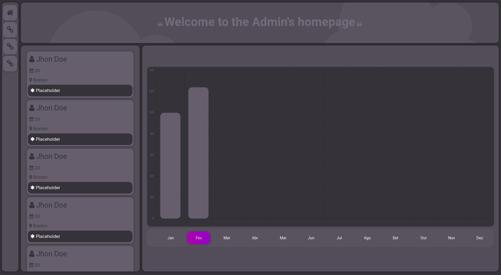

## 🦾 Tela de admin criada com react

</img>

## 👾 Tecnologias usadas

- Html
- Javascript
- React Js

## 🧠 Como testar

- Clonar o repositorio

```
git clone https://github.com/valb-mig/react-admin-menu
```

- Abrir o projeto e executar os comandos a seguir no terminal

```
npm install

npm start

```